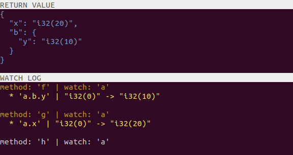

# BScript Toolkit


[](https://github.com/gchudnov/bscript/actions/workflows/ci.yml)

AST Evaluation & Debugging

<br clear="right" /><!-- Turn off the wrapping for the logo image. -->

## Usage

Add the following dependency to your `build.sbt`:

```scala
libraryDependencies += "com.github.gchudnov" %% "bscript-b1" % "1.3.5"

// Optionally, include one or more of the more specific dependencies
libraryDependencies += "com.github.gchudnov" %% "bscript-lang" % "1.3.5"
libraryDependencies += "com.github.gchudnov" %% "bscript-builder" % "1.3.5"
libraryDependencies += "com.github.gchudnov" %% "bscript-interpreter" % "1.3.5"
libraryDependencies += "com.github.gchudnov" %% "bscript-inspector" % "1.3.5"
libraryDependencies += "com.github.gchudnov" %% "bscript-serde" % "1.3.5"
libraryDependencies += "com.github.gchudnov" %% "bscript-rewriter" % "1.3.5"
libraryDependencies += "com.github.gchudnov" %% "bscript-translator" % "1.3.5"
```

## Modules

### Lang

- [/lang](lang) - Basic Language primitives - AST, Symbols & Types.

`TreeVisitor[S, R]` - trait that all AST-processors must implement.

Supported nodes:

```scala
Init
UnaryMinus
Add
Sub
Mul
Div
Mod
Less
LessEqual
Greater
GreaterEqual
Equal
NotEqual
Not
And
Or
Assign
NothingVal
VoidVal
BoolVal
IntVal
LongVal
FloatVal
DoubleVal
DecimalVal
StrVal
DateVal
DateTimeVal
StructVal
Vec
Var
ArgDecl
VarDecl
FieldDecl
MethodDecl
StructDecl
Block
Call
If
Access
CompiledExpr
```

### Rewriter

- [/rewriter](rewriter) - Rewrites AST

- `FilterVisitor` - filter AST nodes.
- `MapVisitor` - map AST nodes.
- `FindVisitor` - find AST nodes.

```scala
val ast0: AST = ???

// filter
val pred: (AST) => Boolean = ???
val errOrRes: Either[Throwable, Option[AST]] = Rewriter.filter(ast0, pred)

// map
val f: (AST) => AST = ???
val errOrRes: Either[Throwable, AST] = Rewriter.map(ast0, f)

// find
val pred: (AST) => Boolean = ???
val errOrRes: Either[Throwable, Option[AST]] = Rewriter.find(ast0, pred)
```

### Serde

- [/serde](serde) - A Serializer & Deserializer for AST.

```scala
import com.github.gchudnov.bscript.lang.ast.*
import com.github.gchudnov.bscript.serde.JSONSerde

val serde = JSONSerde.make()

// Serialize
val t = VarDecl(TypeRef("i32"), "x", IntVal(0))
val errOrSer: Either[SerdeException, String] = serde.serialize(t)

// Deserialize
val input = """{"kind":"VarDecl","type":"i32","name":"x","expr":{"kind":"IntVal","value":"0"}}"""
val errORDes: Either[SerdeException: AST] = serde.deserialize(input)
```

NOTE: Serialization is performed without symbols, in this way if deserialized back, AST should be built again before evaluation.

NOTE: nodes that contain `StdAnn` annotation are omitted from serialization.

### Builder

- [/builder](builder) - Processes AST to define symbols, resolve scopes and assign types. After building, AST can be interpreted.

```scala
val typeNames: TypeNames         = ???
val types: Types                 = Types.make(typeNames)
val typeCheckLaws: TypeCheckLaws = ???

val ast0 = Block(
  VarDecl(TypeRef(typeNames.autoType), "x", IntVal(10)),
  VarDecl(DeclType(Var(SymbolRef("x"))), "y", IntVal(20)),
  Var(SymbolRef("y"))
)

val errOrRes: Either[Throwable, AstMeta] = Builder.build(ast0, types, typeCheckLaws)
```

### Interpreter

- [/interpreter](interpreter) - Interprets AST that has been built.

```scala
val astMeta: AstMeta             = ???
val interpretLaws: InterpretLaws = ???

val errOrRes: Either[Throwable, Cell] = Interpreter.interpret(astMeta.ast, astMeta.meta, interpretLaws)
```

### Translator

- [/translator](translator) - Translates AST to the given programming language. At the moment only translation to Scala is supported.

```scala
val ast1: AST              = ???
val typeNames: TypeNames   = ???
val meta: Meta             = ???

val errOrRes: Either[Throwable, String] = Translator.translateScala(ast1, typeNames, meta)
```

### Inspector

- [/inspector](inspector) - updates AST to trace memory changes between function calls.

```scala
val ast0: AST              = ???
val typeNames: TypeNames   = ???

val errOrRes: Either[Throwable, AST] = Inspector.memWatch("a.b", ast0, typeNames)
```

### B1

- [/b1](b1) - Library that implements laws for B1 Language. Depends on `serde`, `builder`, `interpreter` and `translator` modules.

Allows to load & save AST, build and interpret it, translate it to Scala.

```scala
val str = """{"kind":"VarDecl","type":"i32","name":"x","expr":{"kind":"IntVal","value":"0"}}"""

// Load AST from JSON
val errOrAst: Either[Throwable, AST] = B1.load(str)

// Save AST to JSON
val ast0: AST = ???
val errOrStr: Either[Throwable, String] = B1.save(ast0)

// Build AST
val errOrAstMeta: Either[Throwable, AstMeta] = B1.build(ast0)

// Interpret AST
val astMeta: AstMeta = ???    // AST that was built before with Metadata
val errOrCell: Either[Throwable, Cell] = B1.interpret(astMeta)

// Run - A shortcut for `B1.build` and `B1.interpret`
val errOrCell: Either[Throwable, Cell] = B1.run(ast0)

// Debug - Augment code with memory tracing and Run it
val errOrRes: Either[Throwable, (Cell, Seq[MemWatchDiff])] = B1.debug("a", ast0)

// Translate AST to Scala
val errOrScala: Either[Throwable, String] = B1.translateScala(ast0)
```

### B1-CLI

- [/b1-cli](b1-cli) - Command-Line Utility for B1 Language.

The current version can be downloaded from the [releases](https://github.com/gchudnov/bscript/releases) section.

After downloading and extracting, run: `chmod +x b1-cli` to make the file executable. When running, the file required a java runtime to be present on the machine.

Allows to run and debug AST.

```text
b1-cli 1.3.4
Usage: b1-cli [run|debug|export] [options] <file>

  -h, --help               prints this usage text
  --version                prints the version
  <file>                   AST file to be processed

Command: run
run AST-file

Command: debug [options]
debug AST-file
  -r, --ref <value>        reference to the variable to watch: a.b.c

Command: export [options]
export AST-file
  -l, --lang <value>       language to export: [scala3,scala3j]
  -o, --out <value>        Path to output file
  --prelude <value>        include standard library functions in the generated code (default: true)

Examples:

  - Run AST
    b1-cli run /path/to/ast.json

  - Debug AST
    b1-cli debug --ref="a.b.c" /path/to/ast.json

  - Export AST
    b1-cli export --lang=scala3 --out=/path/to/out.scala /path/to/ast.json
```

To use the command line utility, assembly `b1-cli` first:

```bash
sbt assembly
```

Usage:

```bash
cd ./target

# run
./b1-cli run ../examples/ast-example-1.json

# debug
./b1-cli debug --ref="a" ../examples/ast-example-1.json
./b1-cli debug --ref="a" ../examples/ast-example-2.json
./b1-cli debug --ref="y" ../examples/ast-example-3.json

# export
./b1-cli export --lang=scala3 --out=../examples/ast-example-1.scala ../examples/ast-example-1.json
```

#### Run

When running AST, for example [examples/ast-example-1.json](examples/ast-example-1.json) that can be represented as the following Scala code:

```scala
final case class A(
  var x: Int,
  var b: B
)

final case class B(
  var y: Int
)

var a: A = A(
  x = 0,
  b = B(
    y = 0
  )
)

def f(x: Int): Unit =
  a.b.y = x

def g(x: Int): Unit =
  a.x = x

def h(): Unit = {}

f(10)
g(20)
h()

a
```

```bash
./b1-cli run ../examples/ast-example-1.json
```

the last evaluated `a` value will be printed to stdout:

```
RETURN VALUE
{
  "x": "i32(20)",
  "b": {
    "y": "i32(10)"
  }
}
```

#### Debug

This mode is useful to trace modification of a variable in AST.

By running `b1-cli` in _debug_ mode and tracing changes of variable `a`:

```bash
./b1-cli debug --ref="a" ../examples/ast-example-1.json
```

We can observe the follwing output:



```text
RETURN VALUE
{
  "x": "i32(20)",
  "b": {
    "y": "i32(10)"
  }
}

WATCH LOG
method: f() | watch: 'a'
  * 'a.b.y' | "i32(0)" -> "i32(10)"

method: g() | watch: 'a'
  * 'a.x' | "i32(0)" -> "i32(20)"

method: h() | watch: 'a'
```

Here we can see the returned value and the watch log, that traces modification of varaibles in structure `a` across function calls.

NOTE: it is possible to trace the member of a structure, e.g.: `a.x` or `a.b.y` in the example:

```bash
./b1-cli debug --ref="a.x" ../examples/ast-example-1.json
./b1-cli debug --ref="a.b.y" ../examples/ast-example-1.json
```

#### Export

The *export* command can be used to generate a representation of AST in the given programming language. At the moment only *Scala* `--lang=scala3` and *Scala with Java types* `--lang=scala3j` are supported.

```bash
./b1-cli export --lang=scala3 --out=../examples/ast-example-1.scala ../examples/ast-example-1.json
```

## Contact

[Grigorii Chudnov](mailto:g.chudnov@gmail.com)

## License

Distributed under the [The MIT License (MIT)](LICENSE).
